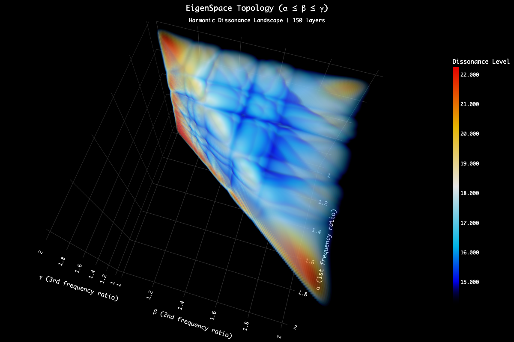

# 4D Harmonic Eigenspace

**Interactive 4D Psychoacoustic Dissonance Visualization for Microtonal Harmony**

[](https://dazzid.github.io/ANIMA_Harmonic_Eigenspace/)
[](https://cordis.europa.eu/project/id/101203318)


*Dissonance landscape showing consonant valleys where harmonic series align*

---

## 🎵 About This Project

This project is part of **ANIMA** (Artificial INtelligence-based Interactive Microtonal Compositional Assistant), a Marie Skłodowska-Curie Actions (MSCA) Postdoctoral Fellowship funded by the European Union's Horizon Europe program.

** STATUS: Under Active Development**

This repository contains research tools for exploring microtonal harmony through computational psychoacoustics. The system visualizes the 4-dimensional consonance/dissonance landscape of tetrachords using the Plomp-Levelt model.

---

## 🎹 What is the Harmonic Eigenspace?

The **Harmonic Eigenspace** is an interactive 4-dimensional map of harmonic consonance and dissonance. The visualization explores how three simultaneous frequency ratios (α, β, γ) interact with a root note to create varying degrees of psychoacoustic roughness.

### The 4D Space

The four dimensions are:
- **Root** - The fundamental frequency (origin)
- **α (alpha)** - x-axis, 1st frequency ratio
- **β (beta)** - y-axis, 2nd frequency ratio  
- **γ (gamma)** - z-axis, 3rd frequency ratio

What you see is a **3D visualization slice** of the four-dimensional space of tetrachord dissonance relationships. Each axis represents the interaction of **6 first harmonics** at different frequency ratios, computed using the *Plomp-Levelt* roughness model from Sethares' *Tuning, Timbre, Spectrum, Scale*.

### Key Features

- **3D harmonic eigenspace** visualization (α, β, γ frequency ratios)
- **77 local minima detection** with stochastic refinement
- **Real-time audio synthesis** with click-to-play interaction
- **Multi-view modes**: Layered isosurfaces and full 3D volume
- **53-TET integration**: Dynamic keyboard mapping with 13-note chromatic scale
- **MIDI/MPE output**: Send microtonal chords to DAWs (e.g., Ableton Live)
- **MIDI Piano Input**: Map physical MIDI keyboards to dynamic microtonal scales
- **Comparative analysis**: 12-TET, 31-TET, 53-TET chord systems
- **WebGL rendering** with Plotly.js

---

## 🎼 Modal Studio: Microtonal Modal Interchange

**Modal Studio** is a novel interactive environment for real-time exploration and manipulation of microtonal harmonies in 53-tone equal temperament (53-TET), seamlessly integrated within the ANIMA Harmonic Eigenspace application.

### Overview

Building upon traditional 12-TET modal frameworks and incorporating principles from 31-TET, Modal Studio extends conventional interval qualities (major/minor) to include **subminor**, **neutral**, and **supermajor** distinctions across the 53-TET harmonic landscape. This expansion enables musicians to explore unprecedented harmonic territories while maintaining meaningful connections to established modal theory.

### Core Components

#### 1. Scale Editor
An interactive circular visualization tool for manipulating interval configurations in 53-TET:
- **7 draggable nodes** representing scale degrees
- **Real-time interval calculation** with quality indicators (subminor to supermajor)
- **Root rotation** for exploring different modal inversions
- **Visual feedback** showing interval relationships and cumulative step patterns

#### 2. Modal Interchange Grid
An 8×8 grid interface implementing parallel and relative modal substitution techniques:
- **First row**: Primary chord progression (diatonic)
- **Subsequent rows**: Automatic modal interchange substitutions
- **Parallel modes**: Same root, different quality (e.g., C Major → C Dorian)
- **Relative modes**: Different root, preserving intervallic relationships
- **Voice leading preservation**: Smooth transitions between chord voicings
- **Drag-and-drop functionality**: Intuitive chord placement and progression editing

#### 3. Voicing Editor
Spiral visualization interface for precise chord voicing control:
- **Octave rings**: Multiple octaves displayed concentrically
- **Draggable note positions**: Real-time voicing adjustment
- **Chord component analysis**: Automatic identification of root, third, fifth, seventh, and extensions
- **Voice leading indicators**: Visual representation of note movement across voicings
- **Based on Chew's spiral array model** for intuitive spatial representation

### Technical Integration

**Bridge MaxForLive Application**: Custom middleware connecting Modal Studio's 53-TET output with standard MIDI protocols, enabling:
- Seamless integration with Ableton Live (11/12)
- MIDI Polyphonic Expression (MPE) support for microtonal precision
- Real-time pitch bend and CC mapping for 53-TET note rendering
- Compatibility with modern digital audio workstations

### Compositional Applications

Modal Studio facilitates:
- **Microtonal chord progression design** with modal substitution techniques
- **Voice leading optimization** across microtonal harmonic spaces
- **Real-time harmonic exploration** combining eigenspace consonance maps with modal theory
- **Integration of psychoacoustic principles** (Plomp-Levelt) with traditional modal frameworks

---

## 🚀 Usage

### Quick Start
It it only compatible with Google Chrome. 

1. **Visit the live demo**: [https://dazzid.github.io/ANIMA_Harmonic_Eigenspace/](https://dazzid.github.io/ANIMA_Harmonic_Eigenspace/)
2. **Click on any point** in the 3D visualization to hear the corresponding chord
3. **Use your computer keyboard** (z, s, x, d, c, v, g, b, h, n, j, m, ,) to play the dynamic microtonal scale
4. **Optional**: Connect a MIDI keyboard for real-time microtonal performance
5. **Optional**: Configure MIDI output to send microtonal chords to your DAW

### MIDI Setup (macOS)

For MIDI/MPE output to Ableton Live or other DAWs:

1. **Enable IAC Driver** (built-in virtual MIDI):
   - Open *Audio MIDI Setup* → Window → Show MIDI Studio
   - Double-click *IAC Driver* → Check "Device is online"
   
2. **In your browser**:
   - Click the MIDI button in the app
   - Select your IAC port
   
3. **In Ableton Live**:
   - Preferences → Link/Tempo/MIDI
   - Enable *Track* and *Remote* for IAC Driver port
   - Create MIDI track with IAC Driver as input
   - Receive MPE microtonal chords

---

## 🔬 Scientific Background

### Psychoacoustic Model

The visualization maps dissonance values across all possible combinations of three frequency ratios, creating a 3D landscape of psychoacoustic roughness based on:

- **Base Parameters**: 220 Hz fundamental, 6 harmonics, frequency ratios [1.0-2.0]
- **Plomp-Levelt Formula**: 

$$D = \sum_{\text{pairs}} a \times \left[5 \cdot e^{-3.51 \cdot S \cdot \Delta f} - 5 \cdot e^{-5.75 \cdot S \cdot \Delta f}\right]$$
- **Dissonance Range**: 14-22 (emergent from psychoacoustic constants)

The color scale reveals **intersection zones** where harmonic interactions create varying dissonance levels:
- **Blue regions**: Low dissonance (consonance)
- **White areas**: Moderate roughness
- **Red zones**: High dissonance

### Microtonal Resolution: 53-TET

The project uses **53-tone equal temperament** (53-TET), which provides:
- More accurate approximation of just intonation intervals
- Perfect fifth: 1200 × 31:53 = 701.88679 cents (vs. 701.955 cents in pure 3:2 ratio)
- Extended harmonic palette with **5 interval qualities**:
  - **Subminor** (sm), **Minor** (m), **Neutral** (n), **Major** (M), **Supermajor** (SM)
- Applicable to 3rds, 5ths, 7ths, and 9ths

---

## 📚 References

1. **Plomp, R., & Levelt, W. J. M.** (1965). Tonal consonance and critical bandwidth. *The Journal of the Acoustical Society of America*, 38(4), 548-560.

2. **Sethares, W. A.** (2005). *Tuning, Timbre, Spectrum, Scale*. London: Springer. [Available online](https://sethares.engr.wisc.edu/ttss.html)

3. **Fokker, A. D.** (1963). Multiple antanairesis. *Koninkl. Nederl. Akademie van Wetenschappen*.

---

<!-- ## 📖 Citation

If you use this work in your research, please cite:
```bibtex
@software{dalmazzo2024harmonic_eigenspace,
  author = {Dalmazzo, David},
  title = {Harmonic Eigenspace Explorer: Interactive 4D Psychoacoustic Dissonance Visualization},
  year = {2024},
  note = {Part of the ANIMA Project (MSCA Postdoctoral Fellowship, Grant No. 101203318)},
  url = {https://github.com/dazzid/ANIMA_Harmonic_Eigenspace},
  howpublished = {\url{https://dazzid.github.io/ANIMA_Harmonic_Eigenspace/}},
  institution = {Music Technology Group, Universitat Pompeu Fabra}
}
``` -->

### Related Publications

- **Dalmazzo, D., Déguernel, K., & Sturm, B. L. T.** (2024). The Chordinator: Modeling Music Harmony by Implementing Transformer Networks and Token Strategies. *EvoStar 2024*. Springer Nature Switzerland.

- **Dalmazzo, D., Déguernel, K., & Sturm, B. L. T.** (2024). ChromaFlow: Modeling And Generating Harmonic Progressions With a Transformer And Voicing Encoding. *MML Workshop, ECML/PKDD 2024*.

---

## ⚖️ License & Usage Terms

This project is part of the **ANIMA** research project, funded by the European Union's Marie Skłodowska-Curie Actions (MSCA) Postdoctoral Fellowship under Horizon Europe (Grant Agreement No. 101203318).

### Research-Only License

This software is provided **for research and educational purposes only**. 

**Restrictions:**
- ❌ **No commercial use** without explicit written permission
- ❌ **No redistribution** for commercial purposes
- ❌ **No derivative commercial products**

**Permissions:**
- ✅ **Academic research** and study
- ✅ **Educational use** in non-commercial settings
- ✅ **Personal experimentation** and learning
- ✅ **Citing and referencing** in academic publications

**Requirements:**
- Any use must include proper citation (see above)
- Modifications must be clearly documented
- This license notice must be preserved in all copies

For **commercial licensing inquiries** or **collaboration opportunities**, please contact the author.

### Future Open Source Release

Upon completion of the MSCA fellowship, we plan to release core components under an open-source license (GNU AGPL v3) to benefit the research community while preventing unauthorized commercial exploitation.

---

## 🤝 Acknowledgments

### Funding

This project has received funding from the European Union's Horizon Europe research and innovation programme under the Marie Skłodowska-Curie grant agreement No. **101203318**.

**Project Information:**
- **Project Title**: ANIMA - Artificial INtelligence-based Interactive Microtonal Compositional Assistant
- **Project ID**: 101203318
- **CORDIS Page**: [https://cordis.europa.eu/project/id/101203318](https://cordis.europa.eu/project/id/101203318)
- **Call**: HORIZON-MSCA-2024-PF-01
- **Duration**: 2025-2027

### Research Institutions

**Host Institution:**
- **Music Technology Group (MTG)**, Universitat Pompeu Fabra, Barcelona, Spain

**Secondment Institution:**
- **Algomus Lab**, CRIStAL (UMR 9189), Université de Lille, France
- Collaborators: Prof. Mathieu Giraud, Dr. Ken Déguernel

---

## 📜 License & Rights

**© 2025 David Dalmazzo. All Rights Reserved.**

This software and associated research materials are proprietary and confidential. This work is part of the ANIMA MSCA Postdoctoral Fellowship (Project ID: 101203318) funded by the European Union's Horizon Europe program.

### Usage Terms

- **Academic Citation**: Permitted with proper attribution to the author and project
- **Non-Commercial Research**: Contact for collaboration inquiries
- **Commercial Use**: Strictly prohibited without explicit written permission
- **Code Distribution**: Not permitted without authorization

**Unauthorized copying, distribution, modification, or commercial use of this software, algorithms, or associated methods is strictly prohibited.**

### Attribution

When referencing this work in academic publications, please cite:
```
Dalmazzo, D. (2025). ANIMA Harmonic Eigenspace: 4D Psychoacoustic 
Dissonance Visualization for Microtonal Harmony. MSCA Project 101203318.
https://github.com/Dazzid/ANIMA_Harmonic_Eigenspace
```

For licensing inquiries or collaboration opportunities, please contact through institutional channels.

---

## 📧 Contact

**David Dalmazzo**  
Postdoctoral Researcher  
Music Technology Group, Universitat Pompeu Fabra  
Barcelona, Spain

For questions, collaborations, please contact through the institutional channels.
